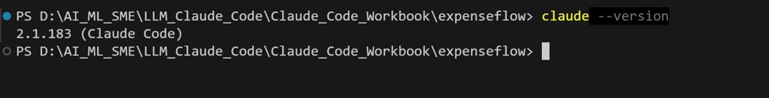
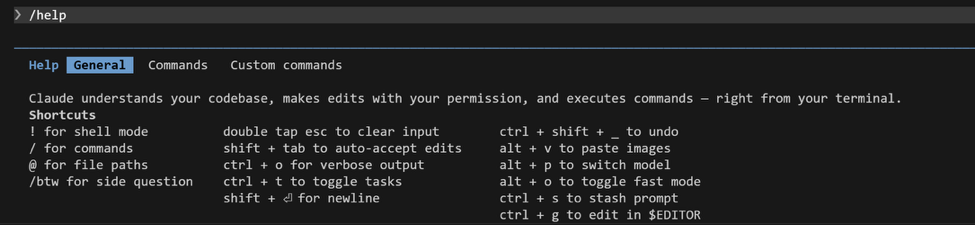
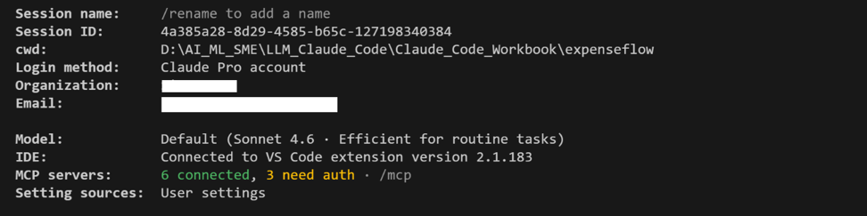
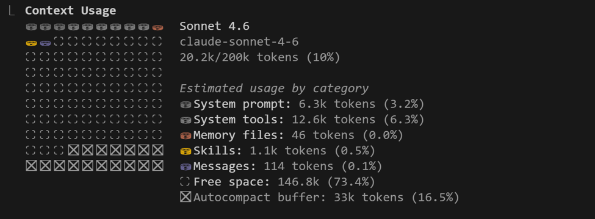
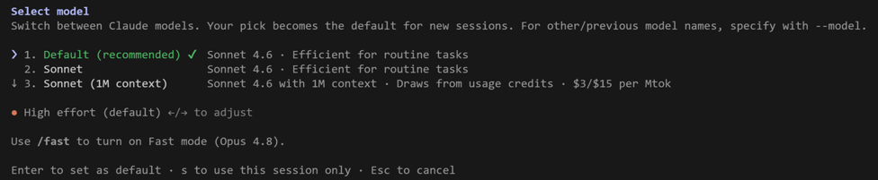
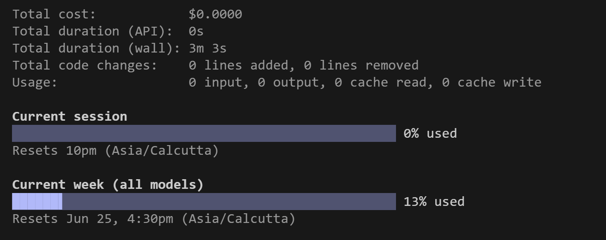

[← Back to index](index.md)

# Exercise 1: First Contact — Orient Inside Claude Code

*Phase 1 · Design & Orient*

| | |
|---|---|
| **Dev cycle** | Design (orientation) |
| **CC features** | `/help`, `/status`, `/context`, `/model`, `/cost`, plan mode (Shift+Tab), permission model |
| **Time** | 25 min |
| **You produce** | A working Claude Code session and a feel for built-in commands |

## Objective

Before you write a line of ExpenseFlow, get fluent in the cockpit. Claude Code is not a chat box: it runs in your terminal, reads and edits files on your machine, and runs commands. This exercise builds muscle memory for the built-in slash commands and the permission model so you stay in control later.

## Walk-through

### 1. Open the right terminal

Open VS Code, open a PowerShell terminal (Terminal > New Terminal), and confirm Claude Code is installed. Slash commands only work once you are inside a session, so first confirm the CLI itself.

**Run in terminal**
```
PS> claude --version
```

> **VALIDATE** `claude --version` prints a 2.1.x build. `claude doctor` reports your install, Node runtime, and auth as healthy. If auth is missing, run `claude auth login` first.



### 2. Start a session and ask what is possible

Launch Claude Code from any scratch folder. Once the prompt appears, type a slash and read the live menu, then open the full reference. The live menu is always the source of truth for your exact version.

**Run in terminal**
```
PS> claude
```

**Type inside the Claude Code session**
```
/help
/status
```

> **VALIDATE** `/help` lists built-in commands plus any bundled skills. `/status` shows your model, working directory, and permission mode.




### 3. Inspect your context and model

Two commands you will lean on constantly. `/context` shows how much of the context window is in use, which is how you avoid quality drops on long builds. `/model` lets you pick the engine for the task.

**Inside the session**
```
/context
/model
```

> **VALIDATE** `/context` renders a usage map (system prompt, files, history). `/model` lists Opus 4.8, Sonnet 4.6, Haiku 4.5 and lets you switch. Leave it on the default for now.




### 4. Meet plan mode and the permission model

Press **Shift+Tab** to cycle the mode indicator at the bottom of the screen between normal, auto-accept, and plan mode. Plan mode lets Claude think and propose without touching files. Then give it a harmless task and watch it ask permission before acting.

**Type this prompt into Claude Code**
```
List the files in this folder and tell me what kind of project this looks like.
```

> **VALIDATE** In plan mode Claude proposes steps but makes no edits. In normal mode it asks for your go-ahead before running a command or writing a file. That approval gate is your safety net: never disable it on day one.

### 5. Check the meter

Cost awareness is a core practitioner habit. Run `/cost` to see token spend for the session so far.

**Inside the session**
```
/usage
```

> **VALIDATE** `/cost` prints tokens and approximate spend for this session. You will return to this in a later exercise when you optimise a long build.



## What success looks like

- You can enter and leave plan mode at will and explain the difference between plan, auto-accept, and normal mode.
- You can name what `/help`, `/status`, `/context`, `/model`, and `/cost` each do without looking them up.
- You understand that Claude asks permission before editing files or running commands, and that you decide.

## Common pitfalls (Windows and macOS)

- If `claude` is not recognised, your PATH was not refreshed: close and reopen the VS Code terminal after install.
- PowerShell may block scripts. If a command is refused, run `Set-ExecutionPolicy -Scope Process -ExecutionPolicy Bypass` for this session only.
- Slash commands do nothing in your normal shell: they only work after you have started a session with `claude`.

## Stretch goal

Type `/` and arrow through the entire menu. Find `/resume` (reopen a past session) and `/clear` (wipe history) and read what each one warns about before you ever need them in anger.

---
[← Back to index](index.md) · [Next: Exercise 2 →](exercise-2.md)
