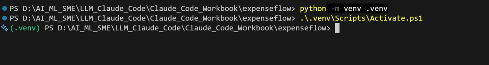
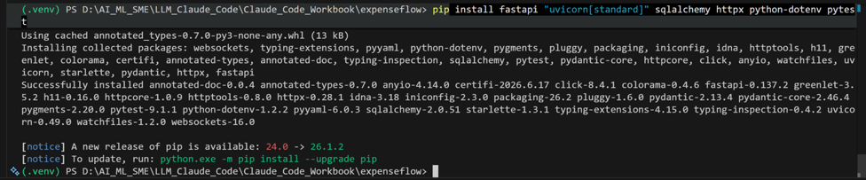
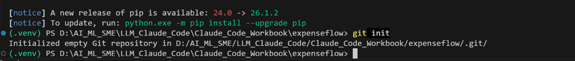
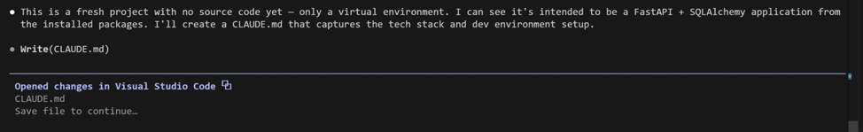
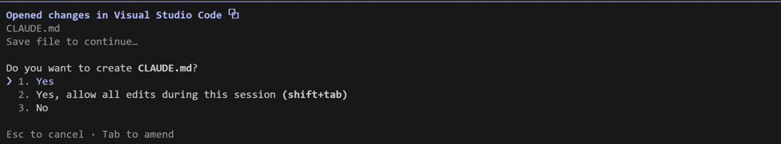
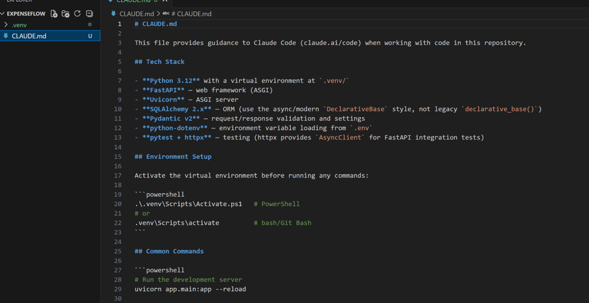
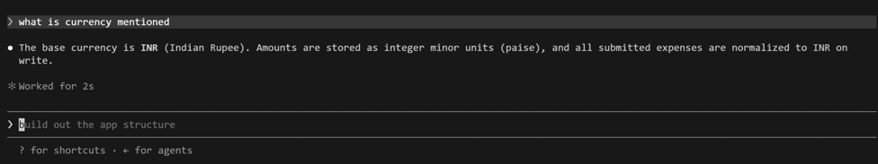

[← Back to index](index.md)

# Exercise 2: Project Genesis — `/init` and the CLAUDE.md Constitution

*Phase 1 · Design & Orient*

| | |
|---|---|
| **Dev cycle** | Design (project setup) |
| **CC features** | `/init`, CLAUDE.md memory file, the `#` memory shortcut, `@file` references |
| **Time** | 35 min |
| **You produce** | An ExpenseFlow project folder, a Python venv, and a hand-tuned CLAUDE.md |

## Objective

Create the project and give Claude its standing instructions. `CLAUDE.md` is the agent's constitution for this repository: it is read at the start of every session and anchors your stack, conventions, and the things Claude must not touch. A good `CLAUDE.md` is the single highest-leverage file you will write all course.

## Walk-through

### 1. Scaffold the folder and environment

Create the project, a virtual environment, and install the stack yourself so you understand the ground truth before Claude touches anything. The only real difference between platforms is how you create and activate the venv.

**macOS / Linux · bash or zsh**
```bash
mkdir expenseflow
cd expenseflow
python3 -m venv .venv
source .venv/bin/activate
pip install fastapi "uvicorn[standard]" sqlalchemy httpx python-dotenv pytest
git init
```

> **VALIDATE** Your prompt now shows `(.venv)`. `pip list` includes fastapi, uvicorn, sqlalchemy, httpx, pytest. A hidden `.git` folder exists. From here on, with the venv active, plain `python` works on both platforms.





### 2. Launch Claude Code and run `/init`

Start Claude Code from inside the project folder, then run `/init`. Claude inspects the directory and drafts a `CLAUDE.md` for you. Review what it proposes rather than accepting blindly.

The `CLAUDE.md` file serves two main purposes:

- Guides Claude through your codebase, pointing out important commands, architecture, and coding style
- Allows you to give Claude specific or custom directions

**Run in terminal**
```
PS> claude
```

**Inside the session**
```
/init
```

> **VALIDATE** A `CLAUDE.md` file appears in the project root. Open it in VS Code: it should mention Python and the libraries you installed.





### 3. Rewrite CLAUDE.md to be specific

The generated file is generic. Replace its body with a precise brief. Specificity here is what stops Claude from wandering for the rest of the build. Paste the following into `CLAUDE.md`, editing freely.

**Create / paste → `CLAUDE.md`**
```markdown
# ExpenseFlow API

## What this is
A small expense submission and approval API. PoC, not production.
One user journey: submit an expense, convert it to a base currency, approve or reject it.

## Stack
- Python 3.12, FastAPI, Uvicorn
- SQLAlchemy ORM on SQLite (file: expenseflow.db) for the PoC
- httpx for the external FX rate call
- pydantic v2 for request and response models
- pytest for tests

## Conventions
- Layout: app/main.py, app/db.py, app/models.py, app/schemas.py, app/routes.py
- Type hints on every function. Docstrings on every endpoint.
- Money is stored as integer minor units (paise / cents), never float.
- Base currency is INR. All amounts are normalised to base on write.
- Never hardcode secrets. Read them from environment variables via python-dotenv.

## Run and test
- Run:  python -m uvicorn app.main:app --reload
- Test: python -m pytest -q

## Do not touch
- Do not edit .venv, .git, or expenseflow.db directly.
- Do not add new third-party dependencies without telling me first.
- Do not invent endpoints that are not in the brief.
```

> **VALIDATE** Save `CLAUDE.md`. The "Money as integer minor units" and "Do not add dependencies without telling me" lines are the two that will pay off most: they pre-empt the two most common AI mistakes.

> **Note:** "Python 3.12" in the Stack section is a generic default, not a hard requirement — use whatever Python 3.x is actually installed in your environment and edit the line to match. The real build behind this walkthrough used Python 3.10, since that was the only version available on the training server.

### 4. Prove Claude is reading it

Start a fresh prompt and ask a question whose answer only exists in `CLAUDE.md`. This confirms the constitution is live.

**Type this prompt into Claude Code**
```
Without writing any code: how should money be stored in this project, and what is the base currency? Answer from CLAUDE.md only.
```

> **VALIDATE** Claude answers "integer minor units (paise)" and "INR". If it does not, your `CLAUDE.md` did not save in the project root: check the path.



## What success looks like

- `CLAUDE.md` describes ExpenseFlow precisely: stack, file layout, money rule, base currency, and explicit do-not-touch boundaries.
- You can demonstrate that a new prompt answers correctly from `CLAUDE.md` alone.
- You know two ways to update the constitution: edit the file directly, or use the `#` shortcut in-session.

## Common pitfalls (Windows and macOS)

- If `.\.venv\Scripts\Activate.ps1` is blocked on Windows, set the per-session execution policy as in Exercise 1, then re-run it. On macOS or Linux the equivalent is `source .venv/bin/activate`, which needs no policy change.
- `CLAUDE.md` only applies to the folder it sits in. If you start `claude` from the wrong directory, it will not be loaded.
- Resist the urge to make `CLAUDE.md` enormous. Tight and specific beats long and vague.

## Stretch goal

Add a user-level memory at `~/.claude/CLAUDE.md` with your personal defaults (for example, "prefer ruff for formatting, explain trade-offs before large refactors"). Project `CLAUDE.md` and user `CLAUDE.md` stack together.

---
[← Previous: Exercise 1](exercise-1.md) · [Back to index](index.md) · [Next: Exercise 3 →](exercise-3.md)
