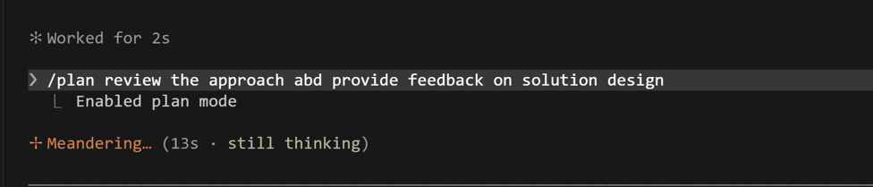
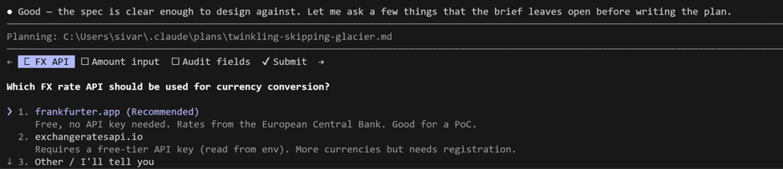
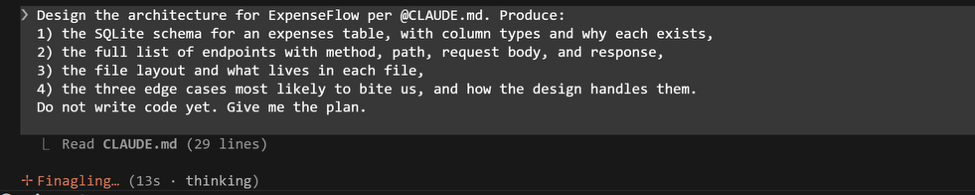
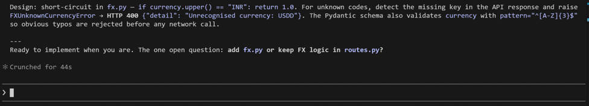
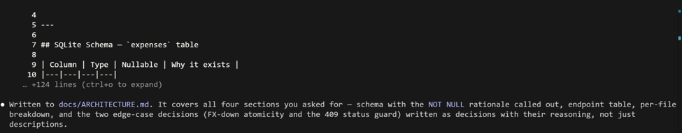

[← Back to index](index.md)

# Exercise 3: Architect First — Plan Mode and the Explore Agent

*Phase 1 · Design & Orient*

| | |
|---|---|
| **Dev cycle** | Design (architecture) |
| **CC features** | Plan mode, the Explore subagent, `@file` references, reviewing a plan before code |
| **Time** | 30 min |
| **You produce** | An agreed architecture and file plan for ExpenseFlow, written to `docs/ARCHITECTURE.md` |

## Objective

The single biggest difference between amateur and professional AI-assisted development is planning before building. You will use plan mode to make Claude design the whole API on paper, critique the plan, and only then let it write a file. Nothing is built here, and that is the point.

Plan mode is cheap. Reviewing a plan takes 30 seconds; reverting wrong edits takes 30 minutes. Force a plan for anything past two files, every time, even when you think you don't need one.

**Planning Mode is best for:**
- Tasks requiring broad understanding of your codebase
- Multi-step implementations
- Changes that affect multiple files or components

**Adjusting to a higher effort level is best for:**
- Complex logic problems
- Debugging difficult issues
- Algorithmic challenges

## Walk-through

### 1. Enter plan mode

Press **Shift+Tab** until the mode indicator reads "plan". In this mode Claude cannot edit files: it can only think and propose. This is your design sandbox. The mode indicator sits at the bottom of the Claude Code screen. Plan mode is also where Claude will route work to the read-only Explore agent for larger codebases.

Run `/effort` to see your current level and adjust it: low is faster and cheaper, max reasons longest on hard problems. The default depends on your model and plan — `/effort` shows you what yours is.

A few example prompts to try while in plan mode:

```
In plan mode only, read the existing plans/docs in this repo and synthesize a single
normalized plan that reconciles overlaps and conflicts. Output one markdown plan that
we will treat as the source of truth.
```

```
In plan mode only, create a high-level implementation plan for adding <feature>. Break
it into phases, list impacted files/folders, identify risks, and define a short
'definition of done'. No code yet.
```

```
In plan mode only, create a high-level implementation plan for adding an Email feature.
Break it into phases, list impacted files/folders, identify risks, and define a short
'definition of done'. No code yet.
```

> **VALIDATE** The mode line shows plan mode. Try asking it to create a file: it will decline and offer a plan instead.




### 2. Brief the architecture

Ask for a complete design, grounded in `CLAUDE.md`, with explicit data model and endpoints. Be demanding about edge cases now, while it is cheap.

**Type this prompt into Claude Code**
```
Design the architecture for ExpenseFlow per @CLAUDE.md. Produce:
1) the SQLite schema for an expenses table, with column types and why each exists,
2) the full list of endpoints with method, path, request body, and response,
3) the file layout and what lives in each file,
4) the three edge cases most likely to bite us, and how the design handles them.
Do not write code yet. Give me the plan.
```

> **VALIDATE** You get a structured plan: an `expenses` table (`id`, `description`, `amount_minor`, `currency`, `amount_base_minor`, `category`, `status`, `submitted_by`, `created_at`), endpoints for create / list / get / approve / reject, and a file map matching `CLAUDE.md`.




### 3. Capture the plan to disk

Now leave plan mode (Shift+Tab back to normal) and have Claude write the agreed design into a docs file. This becomes your reference for the build phase and your handoff artefact later.

**Type this prompt into Claude Code**
```
Write the final agreed architecture to docs/ARCHITECTURE.md. Include the schema,
endpoint table, file layout, and the edge-case decisions we just made.
```

> **VALIDATE** Claude asks permission, then creates `docs/ARCHITECTURE.md`. Open it in VS Code and read it end to end: if you disagree with anything, fix it now, not after 200 lines of code exist.



## What success looks like

- A written, reviewed architecture exists before any application code.
- You forced at least two design decisions (FX failure, double-approval) instead of letting Claude pick silently.
- You can explain why the `expenses` table stores both `amount_minor` and `amount_base_minor`.

## Common pitfalls (Windows and macOS)

- If you skip plan mode and just say "build the API", Claude will make a dozen silent architecture choices you will spend Exercise 8 unwinding.
- `@CLAUDE.md` and `@docs/ARCHITECTURE.md` are file references: the `@` pulls the actual file into context. Typos in the path mean Claude guesses.

## Stretch goal

Ask Claude to use the Explore agent to scan the (currently small) repo and confirm the planned file layout does not clash with anything that exists. On a real codebase this read-only pass is how you onboard safely.

---
[← Previous: Exercise 2](exercise-2.md) · [Back to index](index.md) · [Next: Exercise 4 →](exercise-4.md)
