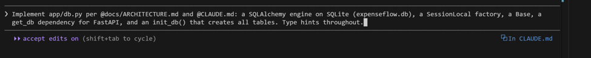
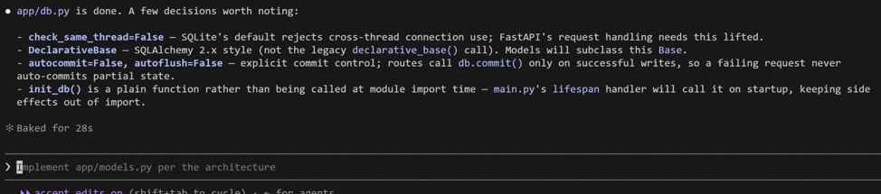
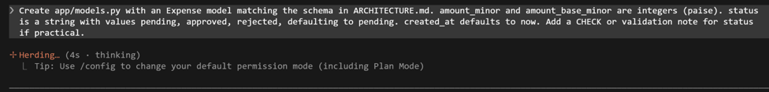
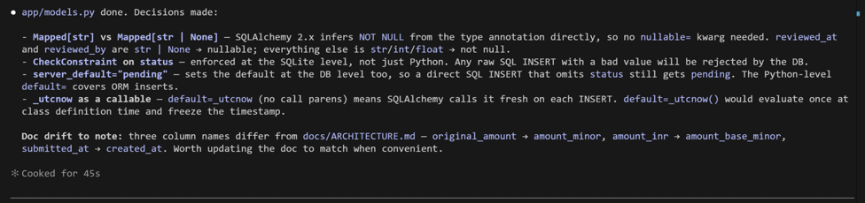
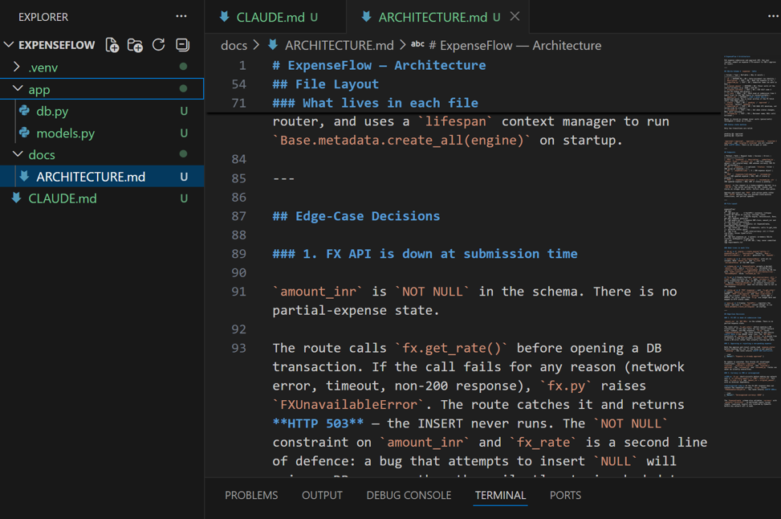
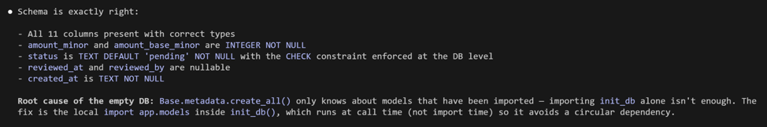
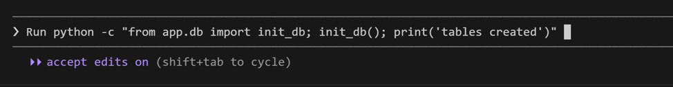
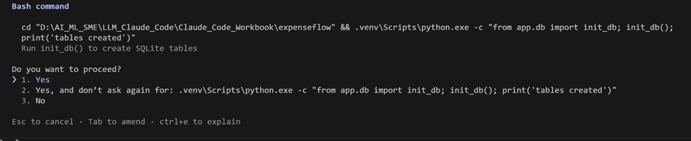
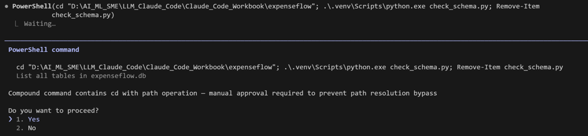

[← Back to index](index.md)

# Exercise 4: The Data Layer — SQL Schema and ORM Models

*Phase 2 · Develop*

| | |
|---|---|
| **Dev cycle** | Develop (data) |
| **CC features** | The build loop, `@file` references, running code to validate, targeted single-file edits |
| **Time** | 35 min |
| **You produce** | Working `app/db.py` and `app/models.py` that create the SQLite schema |

## Objective

Build the foundation: the database. You will run the Claude Code build loop for the first time (prompt, Claude writes, you run, you correct) and learn to validate every step by actually executing the code rather than trusting the output.

## Walk-through

### 1. Generate the database wiring

Ask for the SQLAlchemy engine, session, and base, plus a function that creates tables. Reference the architecture so Claude builds to the agreed plan.

**Type this prompt into Claude Code**
```
Implement app/db.py per @docs/ARCHITECTURE.md and @CLAUDE.md: a SQLAlchemy engine on
SQLite (expenseflow.db), a SessionLocal factory, a Base, a get_db dependency for
FastAPI, and an init_db() that creates all tables. Type hints throughout.
```

> **VALIDATE** Claude proposes `app/db.py` and asks permission. Read the diff: engine points at `sqlite:///expenseflow.db`, `get_db` yields and closes a session in a try/finally. Approve it.




### 2. Generate the model

Now the `expenses` table as an ORM model, honouring the money-as-integer rule from `CLAUDE.md`.

**Type this prompt into Claude Code**
```
Create app/models.py with an Expense model matching the schema in ARCHITECTURE.md.
amount_minor and amount_base_minor are integers (paise). status is a string with
values pending, approved, rejected, defaulting to pending. created_at defaults to
now. Add a CHECK or validation note for status if practical.
```

> **VALIDATE** Read the diff for the `Expense` model: check column types, the `pending` default, and the `created_at` default.






### 3. Create the tables and prove it

Code that has not run is a guess. Have Claude give you a one-liner to initialise the database, then run it yourself in PowerShell.

**Run in terminal**
```
PS> python -c "from app.db import init_db; init_db(); print('tables created')"
```

> **VALIDATE** You see "tables created" and an `expenseflow.db` file appears in the project. If you get a `ModuleNotFoundError` for `app`, add an empty `app/__init__.py` (ask Claude to do it) and re-run.





### 4. Inspect the real schema

Trust, then verify. Confirm the table that was actually created matches what you designed, not what Claude said it created.

**Run in terminal**
```
PS> python -c "import sqlite3,os; c=sqlite3.connect('expenseflow.db'); print(c.execute(\"SELECT sql FROM sqlite_master WHERE name='expenses'\").fetchone()[0])"
```

> **VALIDATE** The printed `CREATE TABLE` statement contains `amount_minor` and `amount_base_minor` as `INTEGER`, a `status` column, and `created_at`. This is ground truth from the database itself.

## What success looks like

- `expenseflow.db` exists and contains an `expenses` table whose columns match your architecture.
- You validated the schema by querying the database directly, not by reading Claude's summary.
- Money columns are integers, as `CLAUDE.md` demands.

## Common pitfalls (Windows and macOS)

- The double-quote escaping in step 4 matters in PowerShell. If it errors, ask Claude: "give me a PowerShell-safe one-liner to print the expenses table schema".
- If imports fail, the usual cause is a missing `app/__init__.py` or running from the wrong directory. Stay in the project root.

## Stretch goal

Ask Claude to add a tiny `scripts/seed.py` that inserts three sample expenses, then run it and query the row count. You now have data to work with in the next exercise.

---
[← Previous: Exercise 3](exercise-3.md) · [Back to index](index.md) · [Next: Exercise 5 →](exercise-5.md)
