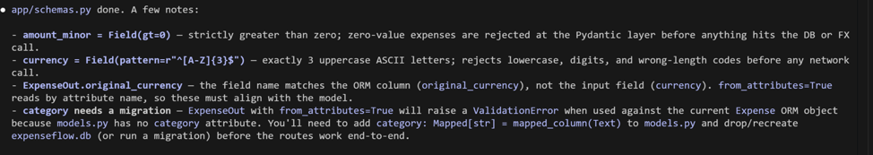
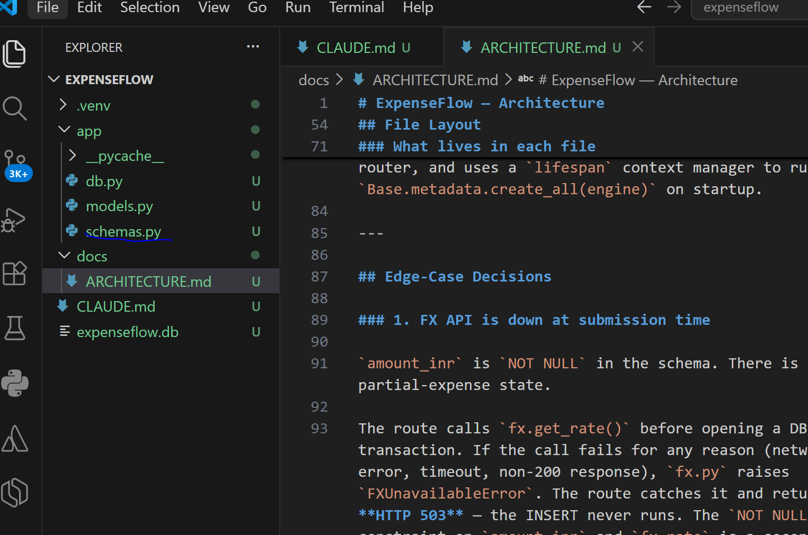
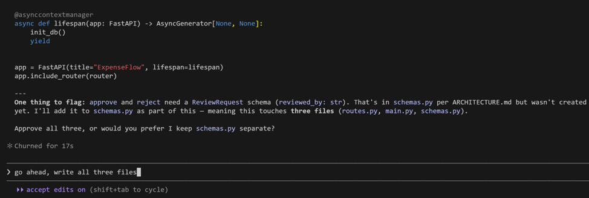
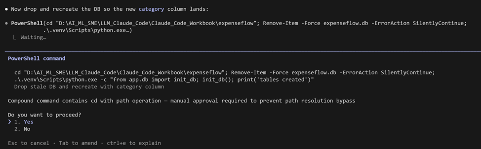
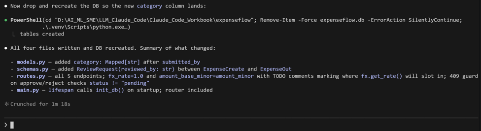
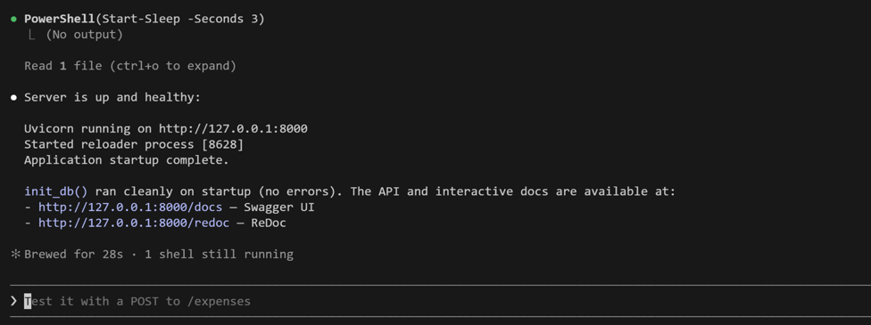
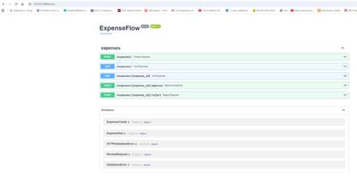
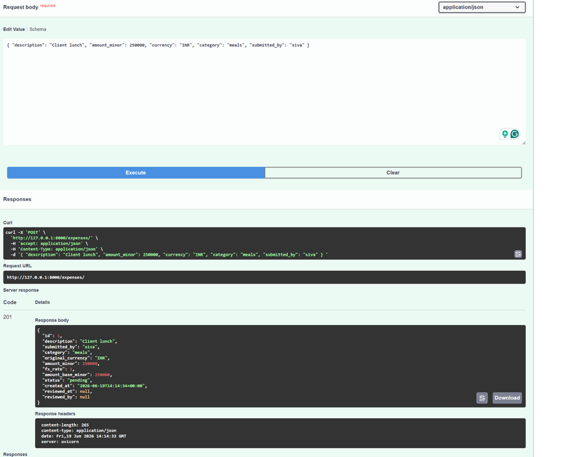
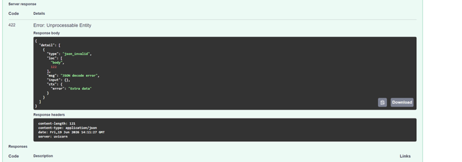
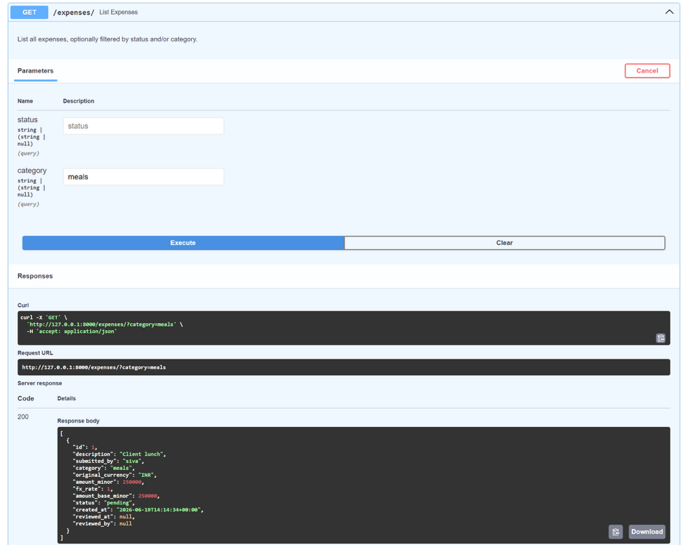

[← Back to index](index.md)

# Exercise 5: The API Surface — FastAPI Endpoints

*Phase 2 · Develop*

| | |
|---|---|
| **Dev cycle** | Develop (API) |
| **CC features** | Build loop, running the live server, validating in the Swagger UI (`/docs`), pydantic schemas, pytest via Claude Code |
| **Time** | 55 min |
| **You produce** | A running FastAPI app with create / list / get / approve / reject / health endpoints, double-approval enforcement, and a passing pytest suite |

## Objective

Stand up the API itself. You will generate pydantic schemas and routes, run the live server with Uvicorn, and validate every endpoint by hand in the auto-generated Swagger UI. This is the most satisfying exercise: by the end you have a clickable API.

## Walk-through

### 1. Generate request and response schemas

pydantic models define the API contract. Keep them separate from the ORM model so the wire format and the storage format can diverge cleanly.

**Type this prompt into Claude Code**
```
Create app/schemas.py with pydantic v2 models: ExpenseCreate (description, amount_minor,
currency, category, submitted_by) and ExpenseOut (all fields including id,
amount_base_minor, status, created_at). Amounts are integer minor units. Add field
validation: amount_minor must be positive, currency is a 3-letter code.
```

> **VALIDATE** `app/schemas.py` defines `ExpenseCreate` and `ExpenseOut` with the field validation described above.




### 2. Generate the routes and app entry point

Now the endpoints and the FastAPI app. Tell Claude to leave the FX conversion as a clearly-marked stub for now: `amount_base_minor` equals `amount_minor`. You will wire real conversion in Exercise 6. Also carry the double-approval decision from Exercise 3's architecture plan through into the code — a decision that stays on paper isn't a decision, it's a wish.

**Type this prompt into Claude Code**
```
Create app/routes.py with an APIRouter and app/main.py with the FastAPI app that
includes the router and calls init_db on startup. Endpoints from ARCHITECTURE.md:
POST /expenses (create, status pending), GET /expenses (list, optional status and
category query filters), GET /expenses/{id} (404 if missing), POST
/expenses/{id}/approve, POST /expenses/{id}/reject. For now set amount_base_minor =
amount_minor with a TODO comment marking where FX conversion goes. Use the get_db
dependency. Per the Exercise 3 decision on double approval: if an expense is already
approved or rejected, a further approve or reject call must return 409, not silently
overwrite the status.
```

> **VALIDATE** Read the diff across `app/main.py` and `app/routes.py`. The TODO marker for FX conversion is present. Approve / reject set status and return the updated expense — and return 409 instead if the expense is already in a terminal state (`approved` or `rejected`). Approve the changes.





### 3. Run the live server

Start Uvicorn with auto-reload. Leave this terminal running and open a second PowerShell tab for other commands.

**Run in terminal**
```
PS> python -m uvicorn app.main:app --reload
```

> **VALIDATE** The terminal shows "Uvicorn running on http://127.0.0.1:8000" and "Application startup complete". Any traceback here is your next prompt to Claude: paste it whole.



### 4. Validate in the Swagger UI

FastAPI auto-generates interactive docs. Open them in your browser and exercise the API by hand. No code needed: this is the demoable surface.

**Open in your browser**
```
http://127.0.0.1:8000/docs
```

> **VALIDATE** All five endpoints appear. `POST /expenses` with a sample body returns 200 and a JSON expense with status `pending` and an id. `GET /expenses` returns it in a list. `GET` on a missing id returns 404. `POST .../approve` flips status to `approved`.



### 5. Drive one full journey

Use "Try it out" in Swagger to run the whole user journey end to end: submit, list, approve, confirm. This is your 60-second demo from the course.

**Sample `POST /expenses` bodies**

Example #1 (2500.00 INR, stored as paise):
```json
{
  "description": "Team lunch",
  "submitted_by": "bob",
  "category": "meals",
  "amount_minor": 250000,
  "currency": "INR"
}
```

Example #2:
```json
{
  "description": "Flight to Bangalore",
  "submitted_by": "alice",
  "category": "travel",
  "amount_minor": 15000,
  "currency": "USD"
}
```

> **VALIDATE** Submit returns id `1`, status `pending`. Approve id `1` returns status `approved`. `GET /expenses?status=approved` returns exactly that expense. The core journey works.





### 6. Add a health check

Every deployment platform's first question is "how do I know it's up?" Add that answer now, while it's cheap, rather than bolting it on later.

**Type this prompt into Claude Code**
```
Add a GET /health endpoint to app/routes.py that returns status "ok" and the row count
of expenses.
```

> **VALIDATE** `GET /health` returns `{"status": "ok", "count": <number of expenses>}`.

**Checkpoint:** update `docs/ARCHITECTURE.md`'s endpoint table to add the `/health` row now that it exists — an architecture doc that doesn't track what you actually built stops being useful by the second exercise. You'll do this again in Exercise 6 when `/reports/insights` is added.

### 7. Write the test suite

`CLAUDE.md` has promised `python -m pytest -q` since Exercise 2. Make that promise true before the API grows any further — manual Swagger checks don't survive a refactor, tests do.

**Type this prompt into Claude Code**
```
Write a pytest suite under tests/ for the API in app/routes.py. Isolate tests from the
real expenseflow.db by setting the DATABASE_URL environment variable to a temp file
path in tests/conftest.py, before app.db and app.main are imported — don't monkeypatch
app.db's internals after the fact. Use FastAPI's TestClient. Cover: creating an expense
(success, and rejecting a non-positive amount_minor), listing expenses filtered by
status and by category, getting a missing expense (404), approving an expense then
approving it again (409), rejecting an expense then approving it (409), and GET
/health. Do not write a test for /reports/insights yet — that endpoint doesn't exist
until Exercise 6, and when it does it will need the Anthropic client mocked so tests
never make a live network call.
```

> **VALIDATE** `python -m pytest -q` runs and every test passes. Re-run it after any later change to `app/routes.py` — a green suite is what lets you refactor without re-clicking through Swagger by hand.

## What success looks like

- Uvicorn serves the app and the Swagger UI lists all six endpoints, including `/health`.
- You ran the full submit → list → approve journey by hand without writing client code.
- The FX conversion is a clearly-marked TODO, deliberately deferred, not silently faked.
- Approving or rejecting an already-terminal expense returns 409 — the Exercise 3 decision on double-approval actually survived into the build.
- A real pytest suite exists and passes, covering the workflow above.

## Common pitfalls (Windows and macOS)

- Port 8000 in use? Add `--port 8001` to the uvicorn command and open `/docs` on that port. On a shared machine this happens often enough that the real build added a script to handle it automatically — see the [addendum](addendum.md).
- Auto-reload only watches code files. If you change `CLAUDE.md` or `.env`, restart the server manually.
- Keep the server terminal running. Run all other commands in a second terminal tab so you do not kill it.

## Stretch goal

Ask Claude to add `DELETE /expenses/{id}`, restricted to expenses that are still `pending` — attempting to delete an `approved` or `rejected` expense should return 409, same as the double-approval guard you just built. This reinforces the terminal-state concept from Step 2 rather than introducing a new one, and add a test for it alongside the suite from Step 7.

---
[← Previous: Exercise 4](exercise-4.md) · [Back to index](index.md) · [Next: Exercise 6 →](exercise-6.md)
