[← Back to index](index.md)

# Exercise 6: Insights with the Claude API

*Phase 2 · Develop*

| | |
|---|---|
| **Dev cycle** | Develop (AI integration) |
| **CC features** | `anthropic` Python SDK, `ANTHROPIC_API_KEY` via `.env`, the build loop on an AI call, prompt engineering, structured JSON output |
| **Time** | 45 min |
| **You produce** | `app/insights.py` and a `/reports/insights` endpoint that summarises spending using Claude |

## Objective

The outside-world integration in this build is an AI call. You will direct Claude Code to wire the Anthropic Python SDK into ExpenseFlow so the API can return a natural-language insight over stored expenses. Treat the model exactly like any other dependency: key in `.env`, a typed function, graceful failure, and prompt iteration until the output is reliable. This is the heart of AI-assisted development: using Claude Code to build a feature that itself calls Claude.

## Walk-through

### 1. Install the SDK and store the key

Add the official Anthropic SDK to the venv and put your key in `.env`. The install is identical on both platforms because the venv is already active.

**Run in terminal**
```
PS> pip install anthropic
```

**Create / paste → `.env`**
```
ANTHROPIC_API_KEY=sk-ant-your-real-key-here
```

Never commit `.env`. If Claude has not already done so, ask it to add `.env` to `.gitignore`. Your key is a secret, like any password.

> **VALIDATE** `pip show anthropic` prints a version. `.env` exists and is listed in `.gitignore`. The key is your real key from the Anthropic Console, not the placeholder.

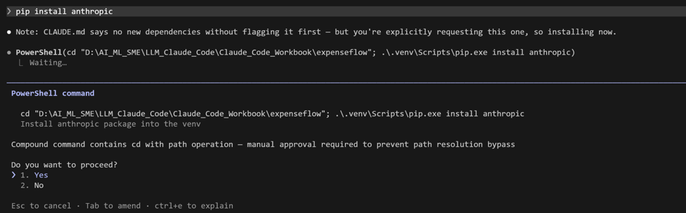
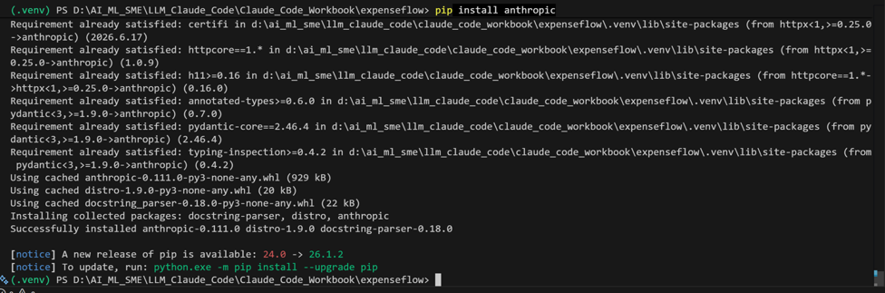

### 2. Have Claude Code build the insights module

Drive the build loop: prompt, read the diff, approve, run. You are asking for a single typed function that calls the Messages API and fails safely.

**Type this prompt into Claude Code**
```
Create app/insights.py. Add generate_insight(expenses: list[dict]) -> str that calls
the Anthropic Messages API using the anthropic SDK with model claude-sonnet-4-6. Load
ANTHROPIC_API_KEY from the environment using python-dotenv. Build a compact text
summary of the expenses (amount_base_minor, category, status) and ask the model for
three short bullet insights about the spending. Set a small max_tokens. Wrap the call
in try/except: on any API or network error, log it and return a safe fallback string.
Add type hints and a module docstring.
```

> **VALIDATE** Read the diff before approving: you should see `client = anthropic.Anthropic()`, a `client.messages.create(...)` call with `model="claude-sonnet-4-6"` and a `max_tokens` value, `load_dotenv()` near the top, and a try/except that returns a fallback. No key is hard-coded.

> **Note:** `claude-sonnet-4-6` here is an illustrative model name from the course material, not a real callable model id. The real build substitutes a real current model id in `app/insights.py` (see the comment left in that file) — the same kind of course-vs-reality substitution already documented for the `ANTHROPIC_API_KEY` `\r` bug in the [addendum](addendum.md).

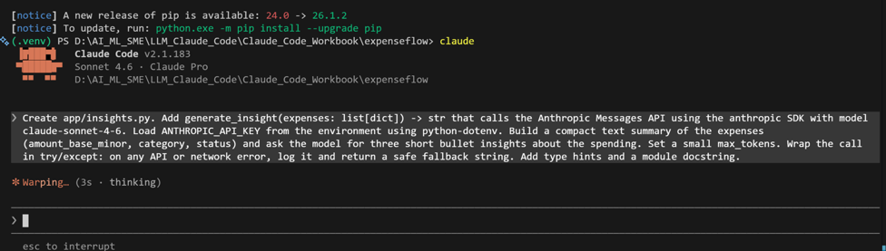
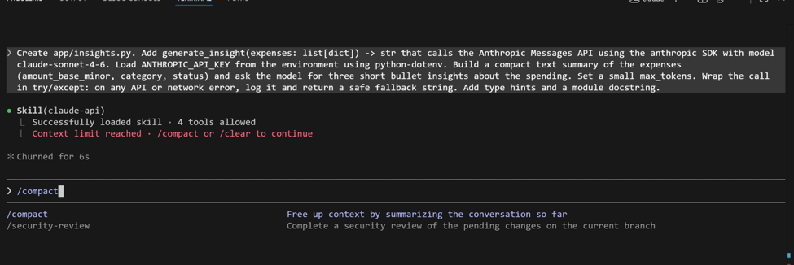
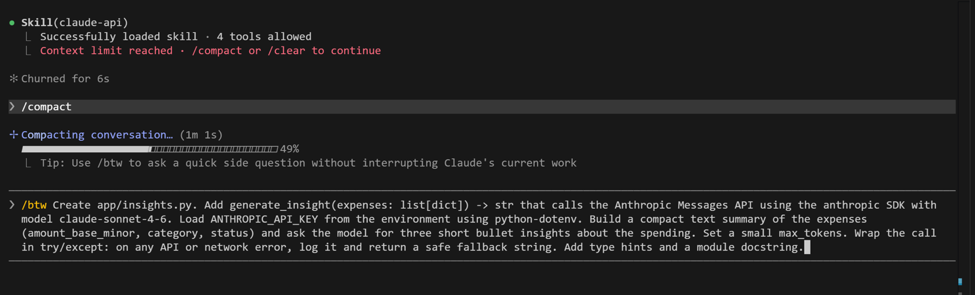
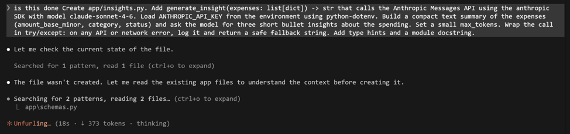
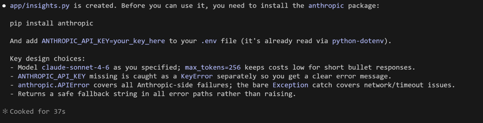
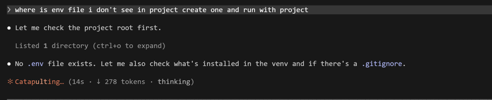
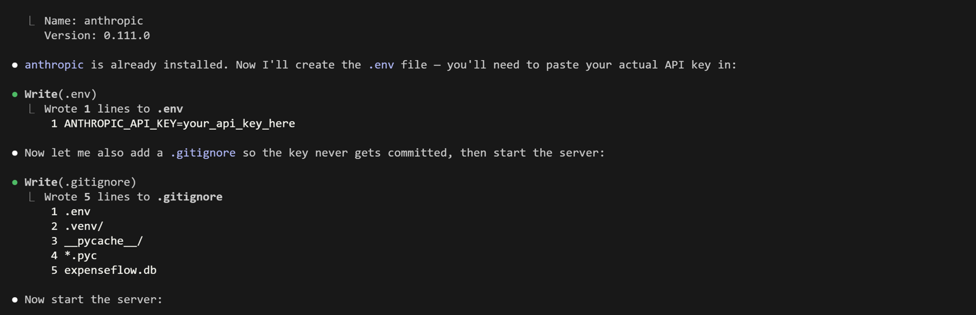
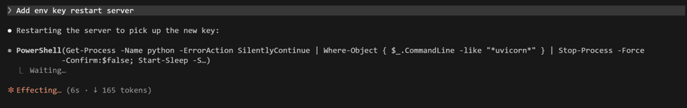

### 3. Expose it as an endpoint

Point Claude at the files it must change with `@` references so it edits the right route module rather than guessing.

**Type this prompt into Claude Code**
```
Add GET /reports/insights to app/routes.py. Load all expenses through the existing
get_db dependency, convert them to a list of dicts, call generate_insight from
app/insights.py, and return {"insight": ...}. Reference @app/insights.py and
@app/routes.py so you edit the existing code.
```

> **VALIDATE** The diff adds one route to `app/routes.py` and imports `generate_insight`. No duplicate router or app object is created.

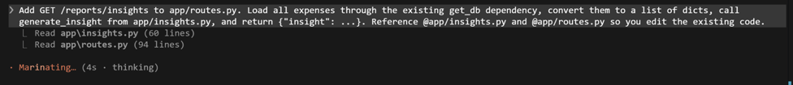
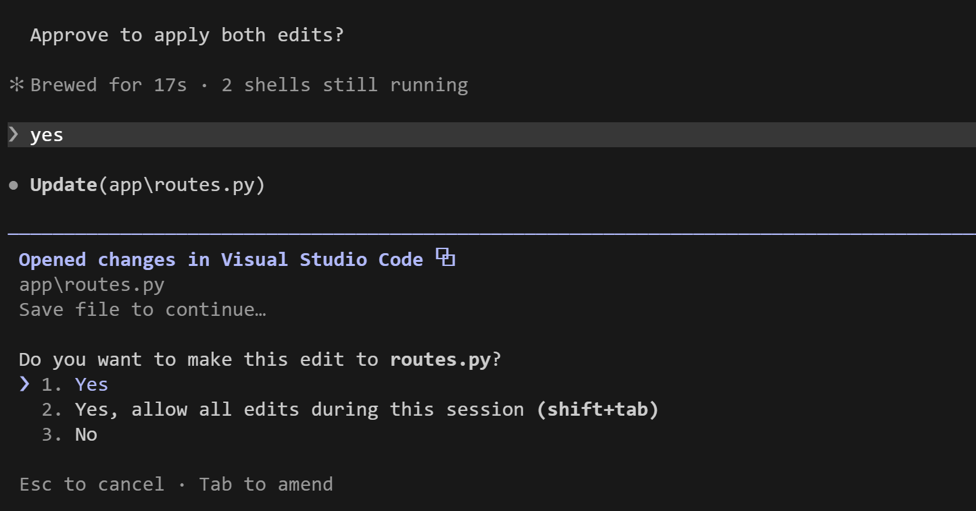

### 4. Run the whole chain

Start the server and exercise the new endpoint from the live Swagger docs. Seed an expense or two first if your table is empty, or the model has nothing to summarise.

**Run in terminal**
```
PS> python -m uvicorn app.main:app --reload
```

**Open in your browser (same URL on every OS)**
```
http://127.0.0.1:8000/docs
```

> **VALIDATE** Calling `GET /reports/insights` returns three bullet insights that actually reflect the categories and amounts in your data. If you get the fallback string, check the uvicorn console for the logged error (usually a missing or wrong key).

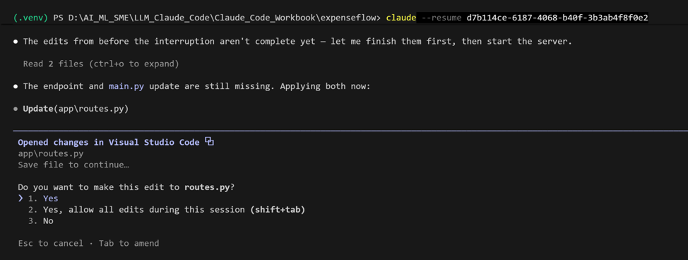
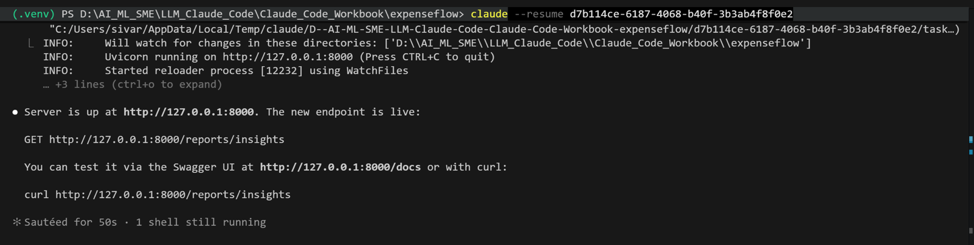
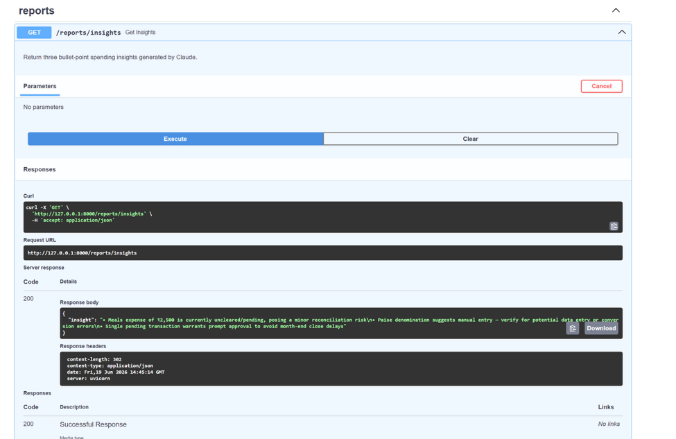

### 5. Engineer the prompt for structured output

Free text is hard to render in a UI. Iterate the prompt so the model returns strict JSON, and make the code defensive about malformed output. This is prompt engineering as a development task, done through Claude Code.

**Type this prompt into Claude Code**
```
In app/insights.py, change the instruction so the model returns strict JSON only: an
object with keys summary (a string) and bullets (an array of exactly three strings).
Add a system prompt that says: respond with JSON only, no prose, no code fences. Parse
the response with json.loads and validate the shape. If parsing fails, retry the call
once, then fall back to a safe default object. Keep max_tokens small. Now that
generate_insight returns the full structured object, update the GET /reports/insights
route in app/routes.py to return it directly instead of wrapping it in {"insight": ...}.
```

> **VALIDATE** `GET /reports/insights` now returns structured JSON with `summary` and a three-item `bullets` array — as the top-level response body, not nested under an `"insight"` key. Temporarily feed it a vague request and confirm malformed model output no longer crashes the route: it retries once, then returns the safe default.
>
> While testing this for real: the model sometimes wraps its JSON in a ` ```json ` code fence even though the system prompt says not to — a live, reproducible failure, not a hypothetical one. `json.loads` chokes on the leading backtick and the parse "fails" even though the model did everything else right. Have Claude add a small helper that strips a leading/trailing code fence before parsing, so this doesn't silently eat into your retry budget.

**Checkpoint:** update `docs/ARCHITECTURE.md`'s endpoint table — add the `/reports/insights` row now that it exists, matching the health-check checkpoint from Exercise 5.

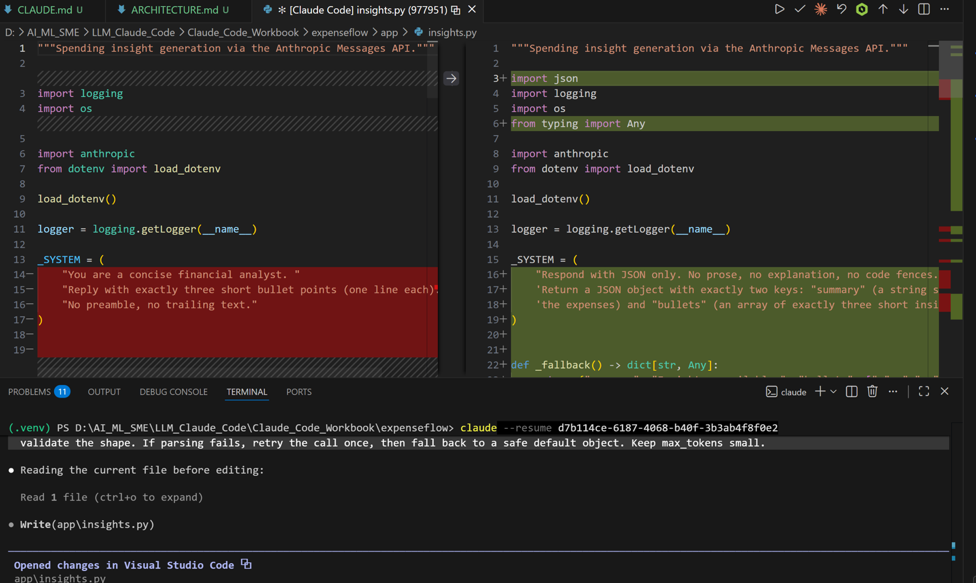
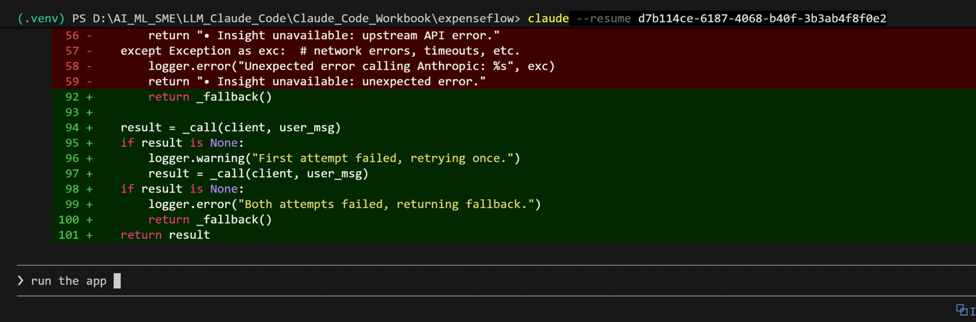
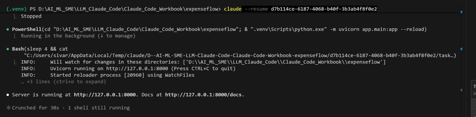
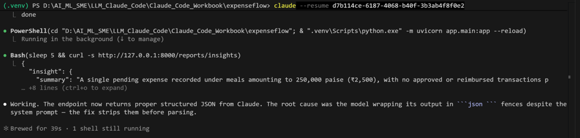
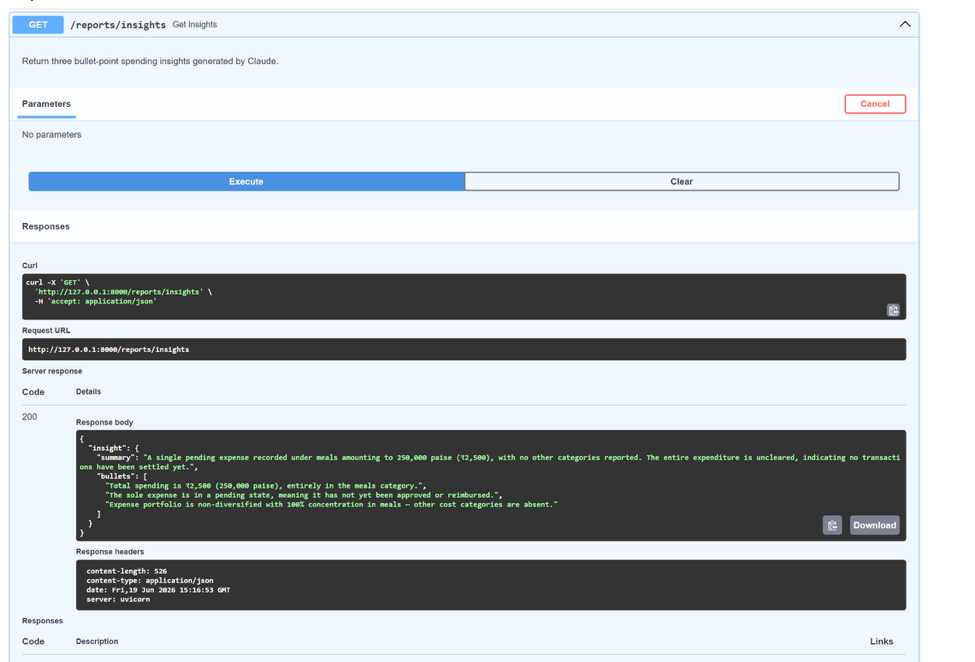

## What success looks like

- You built a feature that calls the Claude API, entirely by directing Claude Code, and you can explain every line of `app/insights.py`.
- The API key lives only in `.env`, the call fails gracefully, and the endpoint returns predictable JSON.
- You can describe the difference between a system prompt and a user message, and why `max_tokens` and a fallback matter in production.

## Common pitfalls (Windows and macOS)

- The key is read as empty: `load_dotenv()` must run before `os.environ` is read, and you must restart uvicorn after editing `.env` because `--reload` does not always re-read the environment.
- The key looks right but every call still fails with a connection error: check for a stray trailing `\r` character (common if the key passed through a Windows-style line ending somewhere). See the [addendum](addendum.md) for how this was diagnosed and fixed in the real build.
- Committing `.env`. Confirm it is in `.gitignore` before your first commit in Exercise 8.
- A model-name typo (for example an old or misspelled name) raises a 404 from the API. The fallback hides it, so always read the uvicorn console when the insight looks wrong.
- Forgetting `max_tokens` leads to slower, costlier calls. Keep insight calls tight.

## Stretch goal

Swap the model to `claude-haiku-4-5` for a cheaper, faster call. Compare the insight quality against `claude-sonnet-4-6` and check the difference with `/cost` inside Claude Code. Note which model you would pick for a latency-sensitive path. (As above, both names are course-illustrative — swap in whatever real current model ids you're actually using.)

---
[← Previous: Exercise 5](exercise-5.md) · [Back to index](index.md) · [Next: Exercise 7 →](exercise-7.md)
