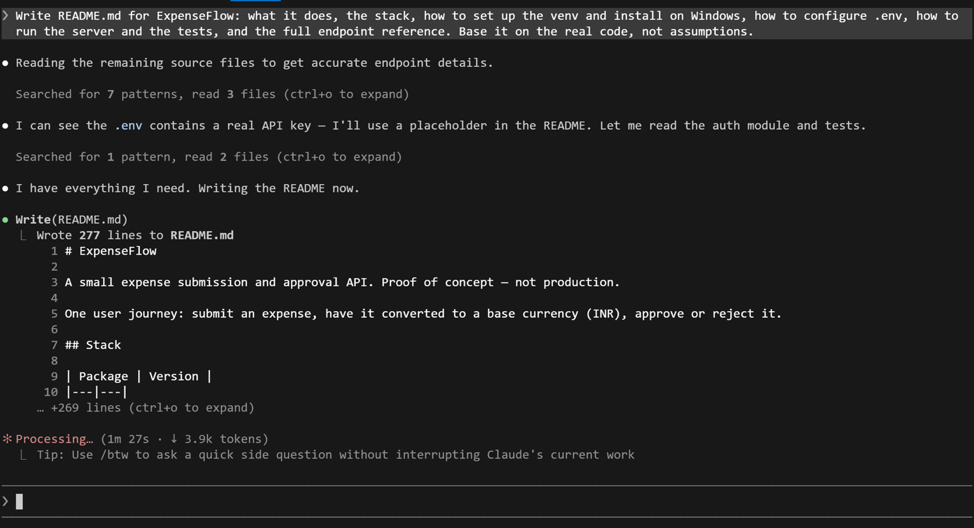
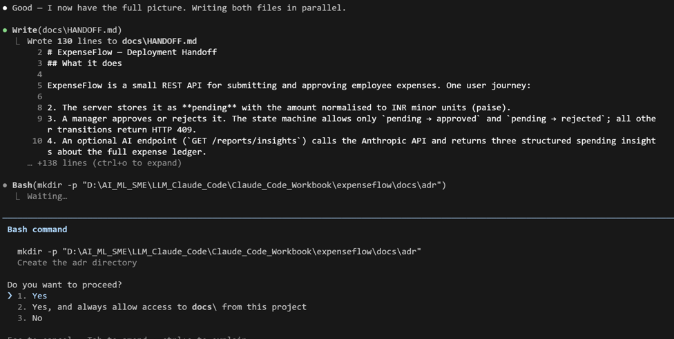
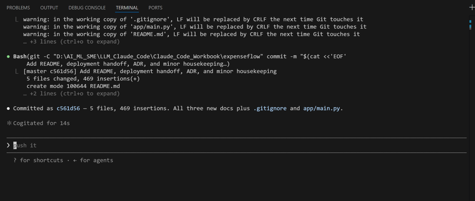

[← Back to index](index.md)

# Exercise 8: Document and Ship

*Phase 4 · Extend, Automate & Ship*

| | |
|---|---|
| **Dev cycle** | Update & Document (handoff) |
| **CC features** | README and ADR generation, `/compact`, `/cost`, git via generated commits, `/install-github-app`, production gap audit |
| **Time** | 45 min |
| **You produce** | A documented, committed, handoff-ready ExpenseFlow plus a production gap report |

## Objective

A PoC nobody can pick up is a dead end. You will generate the documentation an engineer needs to take over, manage context and cost on this now-long session, commit clean work, and produce the production gap audit that tells stakeholders honestly what it would take to ship for real.

## Walk-through

### 1. Generate the README

Documentation-first means the README explains the PoC to a newcomer. Have Claude write it from the actual code.

**Type this prompt into Claude Code**
```
Write README.md for ExpenseFlow: what it does, the stack, how to set up the venv and
install on Windows, how to configure .env, how to run the server and the tests, and
the full endpoint reference. Base it on the real code, not assumptions.
```

> **VALIDATE** `README.md` contains the exact Windows setup commands you used, the `.env` keys, run/test commands, and every endpoint including the ones the skill added. A new teammate could start from zero.



### 2. Write the technical handoff and an Architectural Decision Record (ADR)

Beyond the README, engineering wants the why. Generate a one-page handoff and an architecture decision record for the money-as-integer choice.

**Type this prompt into Claude Code**
```
Create docs/HANDOFF.md (what it does, how it works, what a deployment engineer needs
to know) and docs/adr/0001-money-as-integer-minor-units.md as a short ADR explaining
the decision, the alternatives, and the consequences.
```

> **VALIDATE** Both files exist. The ADR states the decision (integer paise), why (float rounding errors in money), and the trade-off (manual formatting for display). This is the artefact that survives after you have moved on.




### 3. Run the production gap audit

Finally, the honest reckoning. Have Claude assess what stands between this PoC and production, classify each gap, and estimate effort. This is what you take to stakeholders.

**Type this prompt into Claude Code**
```
Audit ExpenseFlow against a production bar: authentication and key rotation, input
validation, rate limiting, observability and logging, error handling, database
migrations and pooling, secrets management, tests and coverage, deployment and health
checks, and data privacy for expense data. For each: state the gap, classify it
blocking or deferrable, and give a rough effort estimate. Write it to
docs/PRODUCTION-GAP.md.
```

> **VALIDATE** `docs/PRODUCTION-GAP.md` lists gaps with blocking/deferrable labels and effort estimates. The honest total is far larger than the PoC itself: that gap, made explicit, is the most valuable thing you can hand a stakeholder before they greenlight engineering.

## What success looks like

- README, HANDOFF, and an ADR exist and are accurate to the real code.
- You managed a long session deliberately with `/compact` and read the bill with `/cost`.
- A clean, conventional commit captures the work, and a production gap audit states honestly what shipping would take.

## Common pitfalls (Windows and macOS)

- `/compact` summarises and keeps the thread; `/clear` wipes it. Do not `/clear` right before you need the project context for docs.
- Generated docs drift from code. Treat README and HANDOFF as living: regenerate them when the code changes materially.
- A gap audit that is too optimistic is worse than none. If Claude is rosy, push: "what would a sceptical SRE add to this list?"

## Stretch goal

Ask Claude to turn `docs/PRODUCTION-GAP.md` into a one-slide executive summary with a recommendation: greenlight, greenlight-with-conditions, or do-not-ship. You now have a documented, reviewed, ship-assessed backend.

---
[← Previous: Exercise 7](exercise-7.md) · [Back to index](index.md)
